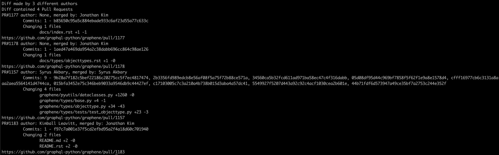

# Github Watcher

Simple script (and a few classes to make my life easier) that uses [Github GraphQL API](https://developer.github.com/v4/)
to inspect some interesting stuff.
Mostly done as an excuse to play with Github's GraphQL API :)


## Setup

* Have python 3 installed
* Install virtual environment `pip install virtualenv`

* Create environment and install requirements
```bash
python -m venv .env
source .env/bin/activate
pip install -r requirements.txt
```

## How to use

* Generate Github API token [here](https://github.com/settings/tokens) with `repo` and `user` read scopes.
* Set github token in your env: `GITHUB_TOKEN=<YOUR-TOKEN>`
* Run `main.py` with required arguments, for example:
Running:
```bash
python main.py \
    --repo-owner "graphql-python" \
    --repo-name "graphene" \
    --branch "master" \
    --token "${GITHUB_TOKEN}" \
    --start-sha "0051f82b5fd7bc8ddb79b68c552f8aa00617b2df" \
    --end-sha "7a1e9d7798f6ce2c7742799ed83cba2b24e03afa"
```
Will output:



### How were Github schema classes was generated?

1. Download json schema
```bash
python -m sgqlc.introspection \
     --exclude-deprecated \
     --exclude-description \
     -H "Authorization: bearer ${GH_TOKEN}" \
     https://api.github.com/graphql \
     github_schema.json
```
    
2. Convert to python classes
```bash
gqlc-codegen github_schema.json reporter/schema.py
```
Warning: `PullRequest` class has been slightly modified (overriden `__eq__` and `__hash__` functions)
to make calculating unique PRs easier.

# Licence
[GNU GPLv3](LICENSE)